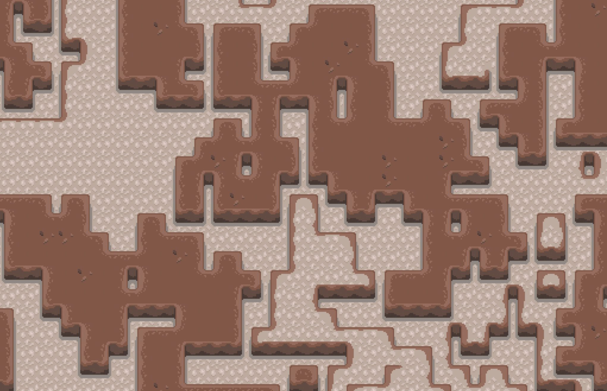

# Wave Function Collapse

An exploration into using the Wave Function Collapse algorithm to generate caves.

Check out the [deployed site](https://sfritton.github.io/wave-function-collapse).



## Running it locally

```sh
npm install
npm start
```

## Dependencies

- [Parcel](https://parceljs.org/)
